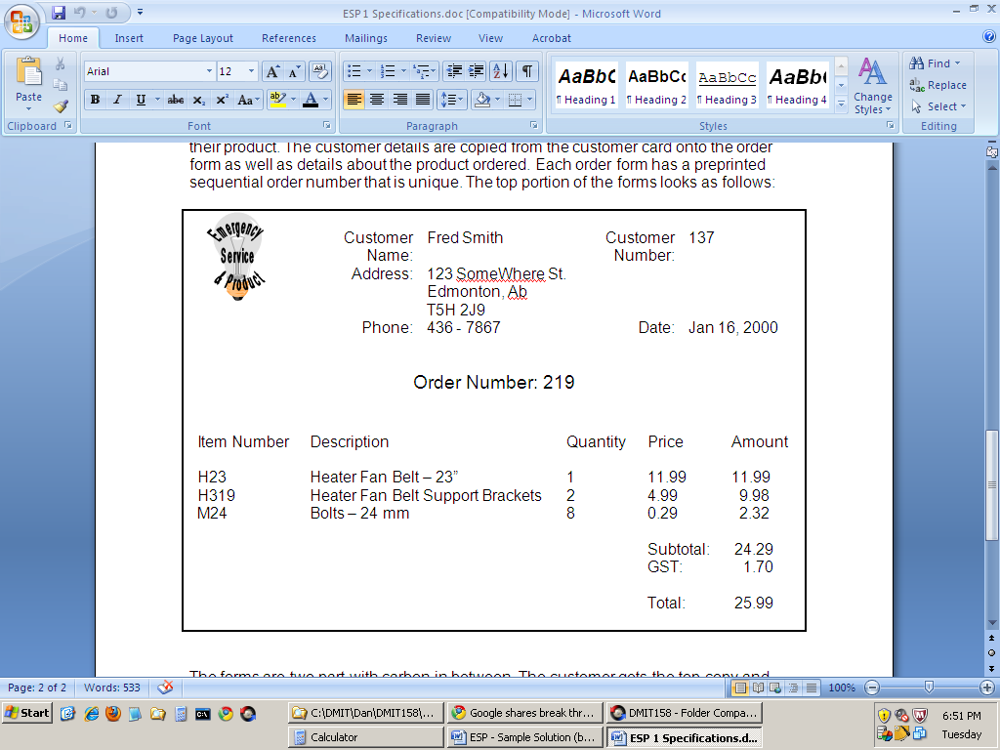

# Normalization Proof of Concept

> The purpose of this document is to see if it is possible to make a nice-looking Normalization document in Markdown.

----

## Customer Orders View

The Customer Orders View and its resulting tables are based on the following form (taken from the original documentation).

 
This form was analyzed according to the rules of 0NF (Zero-Normal Form), 1NF (First-Normal Form), 2NF (Second-Normal Form), and 3NF (Third-Normal Form).

### 0NF

After performing Zero-Normal Form, a single table was generated: **Order**.

**Order**	(CustomerNumber, FirstName, LastName, Address, City, Province, PostalCode, Phone, Date, <q class="pk">OrderNumber</q>, {ItemNumber, Description, Quantity, CurrentPrice, SellingPrice, Amount}, Subtotal, GST, Total)

### 1NF

After performing First-Normal Form, a new table was generated: OrderDetail.

Order	(CustomerNumber, FirstName, LastName, Address, City, Province, PostalCode, Phone, Date, <q class="pk">OrderNumber</q>, Subtotal, GST, Total)

OrderDetail	(<q class="pk"><u class="fk">OrderNumber</u>, ItemNumber</q>, Description, Quantity, CurrentPrice, SellingPrice, Amount)

### 2NF

After performing Second-Normal Form, another new table was generated: Item.
Order	(CustomerNumber, FirstName, LastName, Address, City, Province, PostalCode, Phone, Date, OrderNumber, Subtotal, GST, Total)
OrderDetail	(OrderNumber, ItemNumber, Quantity,  SellingPrice, Amount)
Item	(ItemNumber, Description, CurrentPrice)

### 3NF

After performing Third-Normal Form, another new table was generated: Customer.
Order	(CustomerNumber, Date, OrderNumber, Subtotal, GST, Total)
Customer	(CustomerNumber, FirstName, LastName, Address, City, Province, PostalCode, Phone)
OrderDetail	(OrderNumber, ItemNumber, Quantity,  SellingPrice, Amount)
Item	(ItemNumber, Description, CurrentPrice)

### Merged Tables

These are the merged tables for Customer Details View and Customer Orders View.
Order	(OrderNumber, CustomerNumber, Date, Subtotal, GST, Total)
OrderDetail	(OrderNumber, ItemNumber, Quantity, SellingPrice, Amount)
Item	(ItemNumber, Description, CurrentPrice)
Customer	(CustomerNumber, FirstName, LastName, Address, City, Province, PostalCode, HomePhone)
ERD for ESP Document 1
 

