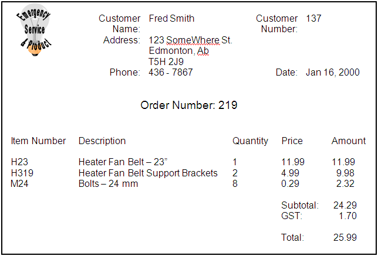

# Normalization Proof of Concept

> The purpose of this document is to see if it is possible to make a nice-looking Normalization document in Markdown.

Your lab is to be submitted as a **Markdown** (`*.md`) file using the following legend. The recommended text editor for these files is [**Visual Studio Code**](https://code.visualstudio.com), as this editor allows you to preview your markdown document as HTML. ERDs can be created using [**Lucidchart**](https://www.lucidchart.com/) and exported as `*.png` files. Check with your instructor about getting a free *Lucidchart* account to use during this course.

## Legend

This legend is a guide to reading and interpreting the table listings under 0NF through 3NF.

> **TableName:** - Table names will be bolded and end with a colon. (e.g.: `**TableName:**`)

> (Column, Names) - Column names for a table will be enclosed in (rounded parenthesis).

> <b class="pk">PrimaryKeyFields</b> - Primary key fields will be bold and inside a box. (e.g: `<b class="pk">PrimaryKeyFields</b>`)

> <u class="fk">ForeignKeyFields</u> - Foreign key fields will be a wavy underline in italic and green. (e.g.: `<u class="fk">ForeignKeyFields</u>`)

> <b class="gp">{</b>Repeating Groups<b class="gp">}</b> - Groups of repeating fields will be identified in 0NF stage, and will be enclosed in orange curly braces. (e.g.: `<b class="gp">{</b>Repeating, Group, Fields<b class="gp">}</b>`)

To make this legend appear correctly in MarkDown, include the following style markup at the end of your markdown file:

```html
<style type="text/css">
.pk {
    font-weight: bold;
    display: inline-block;
    border: solid thin blue;
    padding: 0 1px;
}
.fk {
    color: green;
    font-style: italic;
    text-decoration: wavy underline green;    
}
.gr {
    color: darkorange;
    font-size: 1.2em;
    font-weight: bold;
}
</style>
```

----

## Customer Orders View

The Customer Orders View and its resulting tables are based on the following form (taken from the original documentation).


 
This form was analyzed according to the rules of 0NF (Zero-Normal Form), 1NF (First-Normal Form), 2NF (Second-Normal Form), and 3NF (Third-Normal Form).

### 0NF

After performing Zero-Normal Form, a single table was generated: **Order**.

**Order:**	(CustomerNumber, FirstName, LastName, Address, City, Province, PostalCode, Phone, Date, <b class="pk">OrderNumber</b>, <b class="gr">{</b>ItemNumber, Description, Quantity, CurrentPrice, SellingPrice, Amount<b class="gr">}</b>, Subtotal, GST, Total)

### 1NF

After performing First-Normal Form, a new table was generated: OrderDetail.

**Order:**	(CustomerNumber, FirstName, LastName, Address, City, Province, PostalCode, Phone, Date, <b class="pk">OrderNumber</b>, Subtotal, GST, Total)

**OrderDetail:**	(<b class="pk"><u class="fk">OrderNumber</u>, ItemNumber</b>, Description, Quantity, CurrentPrice, SellingPrice, Amount)

### 2NF

After performing Second-Normal Form, another new table was generated: Item.
Order	(CustomerNumber, FirstName, LastName, Address, City, Province, PostalCode, Phone, Date, OrderNumber, Subtotal, GST, Total)
OrderDetail	(OrderNumber, ItemNumber, Quantity,  SellingPrice, Amount)
Item	(ItemNumber, Description, CurrentPrice)

### 3NF

After performing Third-Normal Form, another new table was generated: Customer.
Order	(CustomerNumber, Date, OrderNumber, Subtotal, GST, Total)
Customer	(CustomerNumber, FirstName, LastName, Address, City, Province, PostalCode, Phone)
OrderDetail	(OrderNumber, ItemNumber, Quantity,  SellingPrice, Amount)
Item	(ItemNumber, Description, CurrentPrice)

### Merged Tables

These are the merged tables for Customer Details View and Customer Orders View.
Order	(OrderNumber, CustomerNumber, Date, Subtotal, GST, Total)
OrderDetail	(OrderNumber, ItemNumber, Quantity, SellingPrice, Amount)
Item	(ItemNumber, Description, CurrentPrice)
Customer	(CustomerNumber, FirstName, LastName, Address, City, Province, PostalCode, HomePhone)


### ERD for ESP Document 1


 
<style type="text/css">
.pk {
    font-weight: bold;
    display: inline-block;
    border: solid thin blue;
    padding: 0 1px;
}
.fk {
    color: green;
    font-style: italic;
    text-decoration: wavy underline green;    
}
.gr {
    color: darkorange;
    font-size: 1.2em;
    font-weight: bold;
}
</style>
